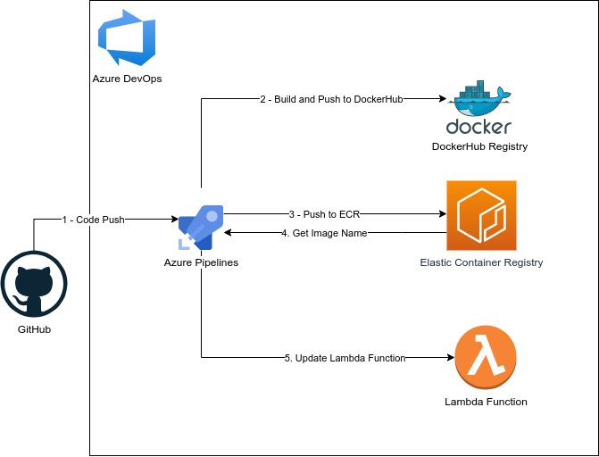
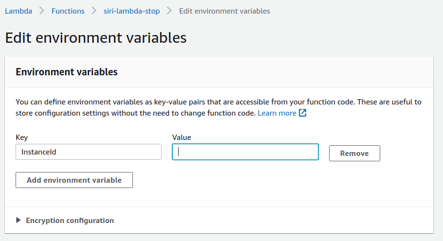

[](https://dev.azure.com/sulabhshrestha/siri-lambda/_build/latest?definitionId=1&branchName=main)

# Siri-Lambda
Connecting Siri with AWS Lambda to turn on/off the VM's

<p align="center">
<!--  -->
  
</p>

<br/>

# Architecture
<p align="center">

</p>
<br />

# Workflow
<p align="center">

</p>
<br />

# Motivation
This project is created to turn on the AWS EC2 Machines from your voice assistance (Siri). For this project I have used AWS Lambda function to invoke the start/stop function for the Instances, triggered by the API Gateway which is called through Siri. I am also using Docker images  rather than the script to put in into the serverless architrecture and using DockerHub as the Registry for public and ECR for Lambda to get the docker images directly. I also have implemented AzureDevOps in this project to make it easier to change the function through the code push into the GitHub. The instances are created using Pulumi (Iac).

# Tools
- AWS EC2 Instance: 
- AWS Lambda Function
- API Gateway
- AWS Elastic Container Registry
- Docker
- Siri
- Azure DevOps
- Docker Hub Registry
- Pulumi 

# How to Use
- The docker images are public so you can use them immediately
```bash
docker pull sulabh4/siri-lambda
```
- And on the Lambda Configuration add the InstanceId

- For Siri Stuffs, you can check this blog in [Medium](https://medium.com/swlh/combining-siri-and-aws-lambda-to-get-the-monthly-aws-spending-of-your-account-59be7cb66679)

---